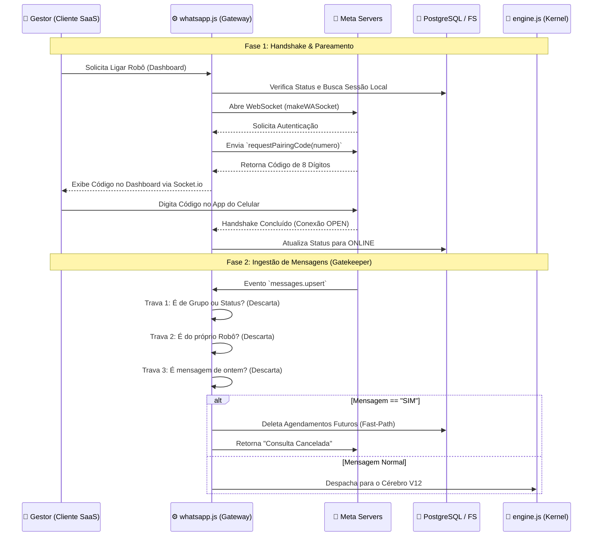
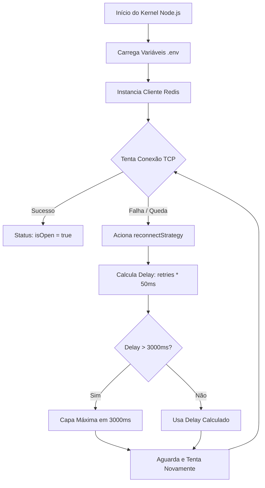
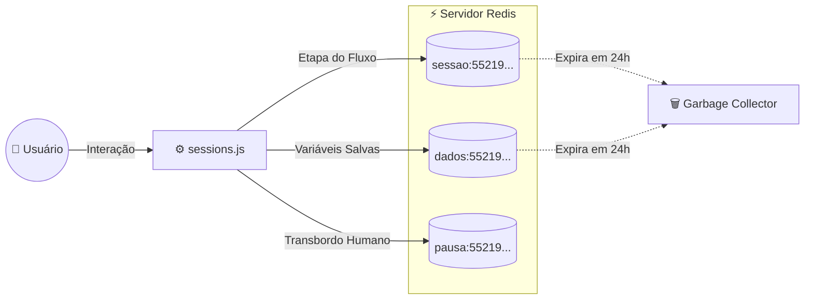
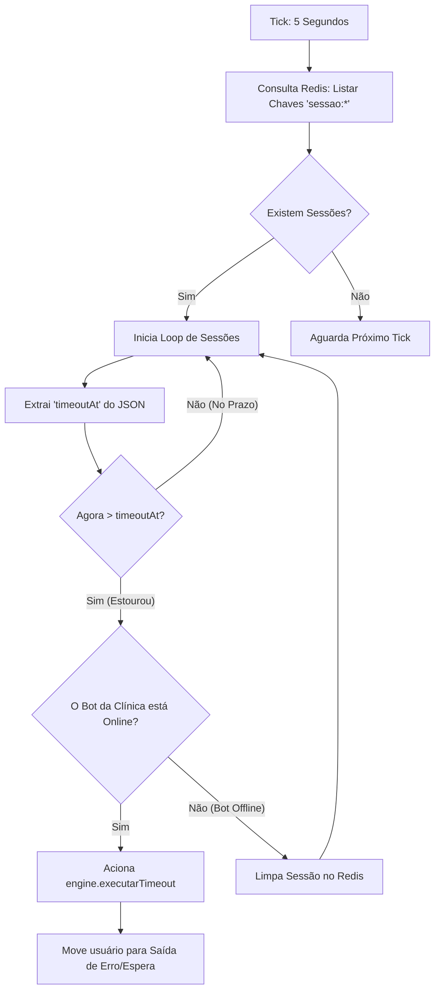

```markdown
# 📡 Módulo Gateway: `whatsapp.js` (V20 Baileys Protocol)


> **Papel Operacional:** Adaptador de Protocolo de Rede e Gatekeeper de Eventos.
> **Objetivo:** Estabelecer, manter e blindar o túnel de comunicação via WebSockets com os servidores da Meta/WhatsApp.

---

## 🗺️ Diagrama de Fluxo de Conexão e Eventos



---

## 📑 1. Arquitetura do Gateway

O `whatsapp.js` opera como um **Padrão de Projeto Adapter (Wrapper)**. Ele isola a complexidade da biblioteca `@whiskeysockets/baileys` do resto do **Calixto OmniSystem**, garantindo que, se o WhatsApp mudar sua API amanhã, apenas este arquivo precisará ser atualizado, preservando a inteligência do negócio (`engine.js`).

### 1.1 Responsabilidades Principais
- **Gerenciamento de Estado (RAM vs Disco):** Mantém a conexão ativa na memória RAM (`sessoes.set()`) enquanto sincroniza as chaves criptográficas Noise Protocol em disco rígido (`/public/sessions/`).
- **Limpeza de Zumbis (Zombie Sockets):** Impede o efeito "bot duplicado". Se a função for chamada duas vezes, ela desliga a conexão antiga e limpa os `listeners` antes de iniciar a nova.
- **Pareamento Dinâmico (Pairing Code API):** Elimina a necessidade de câmera/QR Code, gerando códigos de 8 dígitos para uma experiência fluida de SaaS.

---

## 🛡️ 2. O Gatekeeper: Sistema de Travas (Filtros de Entrada)

A maior causa de travamentos (Out of Memory) em bots de WhatsApp é o processamento desnecessário. O `whatsapp.js` implementa **4 camadas de bloqueio** no evento `messages.upsert` antes de incomodar a `engine.js`:

1.  **Filtro Raiz (Nível de Socket):**
    ```javascript
    shouldIgnoreJid: (jid) => isJidBroadcast(jid) || isJidGroup(jid)
    ```
    Bloqueia o download e a descriptografia de Status (Stories) e mensagens de Grupos diretamente no adaptador de rede. Economiza banda e CPU.

2.  **Anti-Loop Infinito:**
    ```javascript
    if (!msg.message || msg.key.fromMe) return;
    ```
    Impede que o robô responda às suas próprias mensagens, o que causaria um loop infinito que derrubaria a API da Meta.

3.  **Barreira Temporal (Time-to-Live):**
    ```javascript
    if (msgTimestamp < uptimeStart || (Date.now() - msgTimestamp) > 30000) return;
    ```
    Ao reiniciar o servidor, o WhatsApp pode entregar um "lote" de mensagens antigas de uma vez. Esta trava garante que o bot só responda a mensagens novas (enviadas nos últimos 30 segundos).

---

## ⚡ 3. Fast-Path: Roteamento de Alta Performance

A função `whatsapp.js` não é apenas burra (passadora de mensagens). Ela contém um **Atalho de Negócio (Fast-Path)**.

### A Lógica do "SIM" (Cancelamento Rápido)
Quando um cliente responde ao lembrete do Cron com um "SIM", a mensagem **não vai** para a `engine.js` (que precisaria buscar o Drawflow no banco, montar variáveis, etc.).

O `whatsapp.js` intercepta a palavra "SIM", faz uma query ultrarrápida no banco de dados para deletar os agendamentos (`endsWith: numeroLimpo.slice(-8)` para driblar bugs de 9º dígito) e responde instantaneamente. Isso reduz a latência e a carga do servidor.

---

## 🚨 4. Análise de Erros e Resiliência (Self-Healing)

O sistema de conexão possui lógica de autocura (Self-Healing) monitorando o evento `connection.update`.

| Código de Desconexão (Baileys) | Causa Comum | Ação Autônoma do Sistema |
| :--- | :--- | :--- |
| **`401` / `loggedOut`** | O usuário clicou em "Desconectar" no celular dele. | Exclui a pasta física da sessão (`fs.rmSync`), atualiza o DB para `OFFLINE` e emite evento WebSocket para a UI. |
| **`428` / `Connection Closed`** | Queda de internet na VPS ou instabilidade na Meta. | Dispara um `setTimeout` com *Backoff* (3 segundos) e tenta religar o socket silenciosamente. |
| **`515` / `Stream Errored`** | Dessincronização de criptografia. | O bot tenta reconectar. O cache SignalStore ajuda a evitar perda de chaves. |

---

## 📂 5. Gestão de Armazenamento e Criptografia

O cache de sinal (`SignalKeyStore`) é gerenciado pela função `makeCacheableSignalKeyStore()`. 
* **Por que?** O WhatsApp envia centenas de chaves de criptografia por minuto. Se salvarmos isso no disco (SQLite/JSON) a cada segundo, o I/O do disco vai a 100% e o servidor trava. O CacheableStore segura isso na RAM e salva em lotes, garantindo estabilidade Enterprise.
```

---

# 📢 Módulo de Disparo: `broadcast.js` (Mass Messaging Engine)


> **Papel Operacional:** Motor Backend para execução de campanhas de disparo em massa.
> **Objetivo:** Iterar sobre listas de contatos e realizar o envio de mensagens mitigando o risco de bloqueio por spam (Anti-Ban).

---

## 🗺️ Fluxo de Execução (Pipeline de Disparo)

```mermaid
graph TD
    A[Início do Disparo] --> B{Existem contatos na fila?}
    B -- Sim --> C[Extrai Próximo Contato]
    C --> D[Sanitização Regex / Remove Letras]
    D --> E[Formatação JID @s.whatsapp.net]
    E --> F[Disparo via WebSocket]
    F --> G((Gerador de Delay Randômico))
    G -->|Pausa de 10s a 20s| B
    B -- Não --> H[🏁 Missão Concluída]
    
    %% Tratamento de Erro
    F -. Falha no Envio .-> I[Log de Erro Isolado]
    I --> G

    # 📄 Módulo de Documentos: `contratos.js` (PDF Engine)


> **Papel Operacional:** Motor de renderização e manipulação de arquivos PDF.
> **Objetivo:** Buscar templates de contratos no banco de dados, carregar o arquivo físico em memória, gerar instâncias únicas para cada cliente e registrar o artefato no estado da sessão (Redis) para envio via WhatsApp.

---

## 🗺️ Pipeline de Geração de Contratos (I/O Flow)

```mermaid
sequenceDiagram
    participant Engine as ⚙️ engine.js
    participant DocMotor as 📄 contratos.js
    participant DB as 🐘 PostgreSQL
    participant FS as 🗂️ File System (Disco)
    participant Redis as ⚡ Redis (Sessão)

    Engine->>DocMotor: processarContrato(templateId, dadosSessao, userNum)
    DocMotor->>DB: SELECT * FROM ContratoTemplate WHERE id = templateId
    DB-->>DocMotor: Retorna Dados (nome, arquivoUrl)
    DocMotor->>DocMotor: Validação Lógica (Template existe? Tem URL?)
    DocMotor->>FS: fs.readFileSync(caminhoOriginal)
    FS-->>DocMotor: Retorna PDF em Bytes (Buffer)
    DocMotor->>DocMotor: pdf-lib: Carrega e Manipula PDF na RAM
    DocMotor->>FS: fs.writeFileSync(caminhoFinal, pdfFinalBytes)
    Note over FS: Salva arquivo único com Timestamp
    DocMotor->>Redis: Salva 'ultimo_pdf_path' no perfil do usuário
    DocMotor-->>Engine: { success: true, caminho, nomeArquivo }


🕒 Módulo de Monitoramento Proativo: cron.jsDesignação: Calixto Sentinel-Cron Engine.Papel Operacional: Execução de tarefas agendadas em segundo plano (Background Task Runner).Objetivo: Monitorar o banco de dados minuto a minuto, calcular janelas de notificação e disparar lembretes via WhatsApp com validação de JID em tempo real.🗺️ Fluxo de Operação (Sentinel Logic)Snippet de códigograph TD
    A[Início: Tick do Relógio 00s] --> B[Polling Prisma: Busca PENDENTES]
    B --> C{Existem Lembretes?}
    C -- Sim --> D[Loop por Lembrete]
    C -- Não --> Z[Dormir até o próximo minuto]
    
    D --> E[Cálculo de Delta-T: Consulta - Agora]
    E --> F[Busca Configuração do Gestor: T1 e T2]
    
    F --> G{Delta-T == T1 ou T2?}
    G -- Sim --> H[Validação de Identidade: sock.onWhatsApp]
    G -- Não --> D
    
    H --> I[Disparo de Mensagem]
    I --> J[Update Prisma: Status = ENVIADO]
    J --> D
📑 1. Arquitetura de "Vigilância"O cron.js não é um script de resposta; é um Worker de Estado. Ele utiliza a biblioteca node-cron para criar um ciclo de vida infinito que sincroniza o tempo real com o estado do banco de dados PostgreSQL.1.1 Precisão de Tick (* * * * *)O motor é configurado com a expressão cron de 5 asteriscos, garantindo uma resolução de 60 segundos. Isso significa que o sistema tem uma "miopia" máxima de apenas 1 minuto, sendo ideal para sistemas de saúde onde a pontualidade é crítica.1.2 Aritmética de Janela (Time Windowing)O sistema não busca o horário exato, mas sim uma margem de segurança:JavaScriptif (Math.abs(diffMinutos - t1) <= 2)
Por que isso é Engenharia de Software?Servidores podem sofrer pequenos "lags" de processamento ou atrasos de rede. Se buscássemos o minuto exato e o loop atrasasse 1 segundo, o lembrete seria perdido. A margem de 2 minutos garante que o disparo ocorra mesmo sob estresse de hardware.🧠 2. Inteligência de Entrega (Meta Validation)Este módulo implementa o protocolo Meta-Verified JID, resolvendo o problema histórico de entrega no Brasil (o 9º dígito).JavaScriptconst [res1] = await sock.onWhatsApp(jidTentativa1);
O Processo de Descoberta:Tentativa 1 (Raw): Envia o número exatamente como está no banco.Tentativa 2 (Dynamic): Se o número tem 13 dígitos, ele remove o 9. Se tem 12, ele adiciona o 9.Consenso Meta: O sistema pergunta aos servidores da Meta qual desses dois endereços é o JID Real.Entrega Garantida: O lembrete é enviado para o ID validado, eliminando falhas de entrega silenciosas.⚙️ 3. Anatomia das Variáveis OperacionaisO motor traduz as horas configuradas no Painel Administrativo em lógica binária de disparo:VariávelOrigemLógica de ConversãoPapel no Sistemat1cliente.tempoLembrete1Horas * 60Gatilho do primeiro alerta (Geralmente 24h).t2cliente.tempoLembrete2Horas * 60Gatilho de reforço/confirmação final.diffMinutosMath.round()(Consulta - Agora) / 60000O termômetro que decide o momento do disparo.🛡️ 4. Segurança e Resiliência (Self-Healing)O módulo foi desenhado para ser imortal.Isolamento de Erros: O bloco try...catch envolve o loop inteiro. Se um lembrete específico causar um erro de rede, o log é gerado, mas o motor não para. Ele continua para o próximo cliente da fila.Trava de Status: O sistema só envia mensagens se o status for PENDENTE ou LEMBRETE_1. Uma vez enviado, o status muda no Prisma para ENVIADO, impedindo que o cliente receba a mesma mensagem repetidamente em cada tick do cron (Anti-Spam).Gestão de Sessões: O módulo utiliza o Map de sessões em RAM (sessoes.get(item.clienteId)), garantindo que mensagens só sejam tentadas se o robô do cliente estiver efetivamente online.Status da Documentação: V12 Enterprise - Finalizada.Próxima Etapa sugerida: Documentação do Kernel de Decisão (engine.js).


🧠 Motor de Processamento Central: engine.js (Kernel V12 Platinum) - Parte 1/2
Designação Operacional: Sistema Nervoso Central e Roteador Dinâmico.
Objetivo: Ingerir mensagens cruas do WhatsApp, consultar o estado do usuário no Redis em microssegundos, aplicar regras de negócio (Horário, CPF, Conflitos) e determinar o avanço no funil configurado no Drawflow (Prisma).

🗺️ Topologia de Execução (Fase 1: Ingestão e Validação)
Snippet de código
graph TD
    A[Mensagem Recebida] --> B{Comando Global?}
    B -- Sim (#BOT / #RESET) --> C[Sobrescreve Redis / Libera Pausa]
    B -- Não --> D{Verifica Status do Robô}
    
    D -- ONLINE --> E[Consulta Sessão Redis]
    D -- OFFLINE/Inativo --> Z[Fim do Processo]
    
    E --> F{Usuário tem Estado Atual?}
    F -- Não --> G[Inicia no nó 'inicio']
    F -- Sim --> H[Aplica Regra do Nó Atual]
    
    H --> I[Nó de Pergunta: Salva Variável]
    I --> J{Gatilho Específico?}
    J -- Agendamento --> K[Valida NLP, Horário Comercial e Conflito]
    J -- CPF --> L[Busca Prisma: Lista Agendamentos]
    J -- Cancelamento --> M[Valida Index JSON e Executa Delete]
🛠️ 1. Camada de Utilitários Core (Utilities Layer)
Antes da lógica de roteamento, o sistema carrega ferramentas de manipulação de dados em memória e Processamento de Linguagem Natural (NLP) para garantir que as entradas do usuário final (sempre caóticas) sejam padronizadas para o banco de dados.

1.1 Funções de Normalização e NLP
normalizar(texto): * Lógica: Executa conversão para minúsculas, desestruturação Unicode (normalize("NFD")) e Regex (replace(/[\u0300-\u036f]/g, "")) para arrancar acentuação e cedilhas.

Impacto no SaaS: Essencial para que os menus funcionem mesmo se o cliente digitar "Opção", "opcao" ou "OPCAO".

tratarDataAmigavel(texto):

Lógica: Um mini-motor de IA determinística. Usa uma cadeia de expressões regulares (/(\d{1,2})\/(\d{1,2})(?:\/(\d{2,4}))?\s+(\d{1,2}):(\d{1,2})|(\d{1,2}):(\d{1,2})/) para varrer strings complexas.

Impacto no SaaS: Permite que o paciente agende usando linguagem fluida (ex: "Quero marcar para amanha", ou "31/03 14:00", ou apenas "14:00"). Calcula a virada de mês e ano automaticamente utilizando o objeto Date() do Node.js.

1.2 Heurística Humana (UX)
calcularTempo(texto) e delay(ms):

Lógica: Conta os caracteres da string de resposta e multiplica por 50ms, limitando entre o piso de 1 segundo (1000ms) e o teto de 5 segundos (5000ms).

Impacto no SaaS: O robô exibe "digitando..." no WhatsApp por um tempo proporcional ao tamanho do texto que enviará, simulando latência humana perfeita.

1.3 Navegação e Limpeza (State & Storage)
getNextNodeId(node, outputName): Varre o JSON aninhado do Drawflow de forma segura (usando Optional Chaining ?.) para descobrir para qual bloco a linha está apontando. Evita TypeError se uma linha no painel for deletada incorretamente.

limparAgendamentosAntigos(prisma, clienteId) (Garbage Collector): * Executado de forma assíncrona logo na entrada de qualquer mensagem. Varre o banco e apaga agendamentos com mais de 2 horas de atraso, impedindo a degradação de performance do PostgreSQL por acúmulo de dados mortos na tabela Lembrete.

🧠 2. Máquina de Roteamento (processarMensagem)
A função principal, que atua como o cérebro monolítico.

2.1 Override e Comandos de Nível de Sistema (God Mode)
Antes de processar qualquer lógica do painel, a Engine escuta chaves de interrupção (Global Overrides):

#BOT ou 3BOT: Altera a flag booleana isPausado no Redis para false. Devolve o controle do fluxo para a máquina, removendo o transbordo humano.

#RESET: Dispara sessions.limparSessao(userNum). Aplica um DEL na chave Redis do usuário e o empurra de volta para o nó inicio do Drawflow. É o botão de pânico para o cliente preso num fluxo.

2.2 Descoberta de Estado e Avanço
Se o cliente é verificado como ONLINE e possui um JSON de fluxo válido, o motor usa estadoAtualId para saber onde ele parou na conversa anterior.
Se o estado atual for um nó do tipo pergunta, o código engatilha a intercepção de respostas.

🎯 3. Gatilhos de Alta Complexidade (Business Triggers)
Dentro do nó pergunta, variáveis específicas engatilham blocos inteiros de regras de negócio.

3.1 Gatilho de Cancelamento (lista_cancelamento)
Contexto: O usuário buscou agendamentos por CPF e o Redis armazenou um Array de IDs atrelado a ele.

Engenharia: O texto recebido é parseado de String para Inteiro. O motor traduz o número digitado pelo cliente (indexDigitado = texto - 1) para encontrar a posição correta no array JSON gravado no Redis.

Segurança: Apenas se o index for matematicamente válido (>= 0 e < ids.length), o Prisma executa a exclusão (delete). Digitar "0" limpa a variável de cancelamento e devolve o usuário ao fluxo principal de forma limpa.

3.2 Gatilho Analítico (cpf_consulta)
Engenharia: Limpa qualquer traço, ponto ou espaço digitado usando .replace(/\D/g, '').

Execução: Faz uma query findMany ordenada (orderBy: { dataAgendada: 'asc' }) no PostgreSQL para listar todos os horários futuros daquele paciente.

UX Dinâmico: Monta uma string multilinear iterando sobre os resultados, convertendo os índices em emojis visuais com getEmojiNumber() e transformando o bot num painel de autoatendimento.

3.3 Motor Transacional Central (data_agendamento)
O coração do SaaS de clínicas. Requer passagem por 3 barreiras de validação antes da persistência:

Filtro NLP: O retorno da função tratarDataAmigavel() não pode ser null ou NaN. Se for, a execução é interrompida (return;) e o usuário fica travado no nó até mandar uma data compreensível.

Filtro de Horário Comercial (Business Rule): * Lê a configuração nativa do cliente (cliente.usarHorarioComercial).

Trava matemática: Se getDay() for 0 (Domingo) OU getHours() for menor que 8 OU maior/igual a 18, o agendamento é negado. Proteção absoluta contra marcação de consultas de madrugada.

Filtro de Concorrência (Double-Booking Preventer):

Executa um findFirst na exata data/hora solicitada. Se encontrar registro de outro paciente, aborta a transação e exige novo horário.

Persistência e Efeito Colateral:
Se o fluxo sobrevive às travas, o Prisma cria o registro.
A arquitetura aqui brilha ao usar o padrão Fire-and-Forget:

O sock.sendMessage dispara a confirmação para o paciente imediatamente (await).

Um bloco assíncrono isolado monta a notificação push para o Gestor e dispara o alerta para o dono da clínica em segundo plano, incorporando a lógica de inteligência do 9º dígito (slice(0, 4) + slice(5)) para garantir entrega em linhas do DDD 21, mas sem um await que travaria o cliente final esperando a internet do gestor colaborar.

O Gemini disse
🧠 Motor de Processamento Central: engine.js (Kernel V12 Platinum) - Parte 2/2
Designação Operacional: Interpretador Drawflow e Máquina de Estados Recursiva.
Objetivo: Traduzir os nós visuais construídos no front-end para comandos de baixo nível no WhatsApp, manipulando mídias, variáveis dinâmicas, roteamento de tempo e transbordo humano.

🗺️ Topologia de Execução (Fase 2: O Despachante)
Snippet de código
graph TD
    A[Roteador de Estado] --> B{Tipo do Nó?}
    B -- Menu --> C[Filtro de Semântica / NLP]
    B -- Ação Direta --> D[executarNo]
    
    C -->|Match Encontrado| D
    C -->|Entrada Inválida| E[Porta de Fallback] --> D
    
    D --> F[traduzirVariaveis]
    F --> G{Ação do Nó}
    
    G -- Texto/Menu --> H[Delay Humano + Disparo]
    G -- Mídia/Áudio --> I[Leitura de Disco FS + Disparo]
    G -- Horário --> J[Verifica Fuso GMT-3 + Roteia]
    G -- Contrato --> K[Chama Módulo PDF + Salva Redis]
    G -- Transbordo --> L[Pausa Bot + Notifica Gestor]
🎯 4. O Interpretador de Menus (Semântica e Roteamento)
Quando a engine detecta que o usuário está parado em um nó do tipo menu, ela aciona um algoritmo de Fuzzy Matching e validação numérica.

Lógica de Captura:
Indexação Numérica: Lê o que o usuário digitou e tenta converter para número (parseInt(entrada) - 1). Se o usuário digitar "1", ele busca a opcao1 configurada no painel.

Busca Semântica (NLP): Se o usuário digitar um texto (ex: "Falar com atendente") em vez de um número, a engine itera sobre todas as opções do menu usando a função normalizar() (ignorando acentos e maiúsculas) para encontrar um match exato ou parcial.

Fallback de Segurança: Se o usuário digitar "abobrinha" num menu que só tem opções de 1 a 3, a engine aciona a lógica output_${chavesOpcoes.length + 2} (a porta vermelha de erro no Drawflow), garantindo que o fluxo não trave e o usuário receba uma mensagem de "Opção Inválida".

🧬 5. O Motor de Template Dinâmico (traduzirVariaveis)
Esta função transforma textos estáticos em comunicações ultra-personalizadas.

Busca em Memória (Hot Storage): Carrega todo o contexto do usuário do Redis (variaveisSalvas).

Expressões Regulares Globais: Itera sobre as chaves do Redis e utiliza new RegExp('{{'+chave+'}}', 'g') para procurar a sintaxe Mustache (chaves duplas) no texto cru.

Substituição Limpa: Troca {{nome}} pelo nome real. Possui proteção contra valores nulos (|| ""), garantindo que o bot não envie um constrangedor "Olá undefined" para o cliente final.

⚡ 6. O Executor Recursivo (executarNo)
O coração da automação V12. Esta função é recursiva; ela chama a si mesma continuamente até encontrar um nó que exija uma resposta do usuário (como pergunta ou menu), momento em que ela para e devolve o controle ao Redis.

6.1 Tratamento de Texto e Experiência do Usuário (UX)
Simulação de Presença: Antes de enviar, aciona sock.sendPresenceUpdate('composing'). O WhatsApp do cliente mostra "digitando...".

Atraso Matemático: O delay(calcularTempo(txt)) impede que o bot dispare 5 blocos de texto em 0.1 segundos (o que denunciaria o robô e poderia causar bloqueio na Meta).

6.2 Manipulação de Arquivos e I/O de Disco (midia / audio)
Integração FS/Path: Utiliza path.join para buscar o arquivo físico gerado pelo painel web na pasta /public/uploads/.

Mimetype Dinâmico: Se a extensão for .mp4 (áudio do WhatsApp), ele envia com a flag ptt: true (Push-To-Talk). Isso faz o áudio aparecer como se tivesse sido gravado na hora, sem o aviso de "encaminhado". O presenceUpdate também muda de 'composing' para 'recording' (gravando áudio...).

6.3 O Roteador Temporal (horario)
Um bloco de lógica crítica para clínicas e empresas com horário de funcionamento.

Forçador de Fuso Horário: Diferente de scripts básicos que usam o fuso do servidor (muitas vezes em UTC na nuvem), a V12 força a data para America/Sao_Paulo.

Lógica de Porta: Converte HH:MM para minutos absolutos. Se o minuto atual estiver dentro da janela de inicio e fim, o cliente segue pela output_1 (fluxo aberto). Caso contrário, vai para output_2 (fluxo fechado/ausência).

6.4 Máquina de Contratos Automáticos (gerar_documento / enviar_para)
Conecta a engine ao módulo externo contratos.js.

Pipeline: Aciona a geração do PDF e envia instantaneamente o documento recém-gerado.

Routing Externo: O nó enviar_para permite que, logo após o cliente preencher os dados, o contrato gerado seja enviado para o WhatsApp do advogado ou do gestor utilizando o histórico gravado na sessão (ultimo_pdf_path).

6.5 O Transbordo Blindado (transferir)
Silenciador Automático: Invoca sessions.setPausado(userNum, true). O bot "dorme" para aquele usuário específico, permitindo que o humano assuma sem o robô atrapalhar.

Notificação de Equipe: Aciona a mesma inteligência JID (Meta Validation) já documentada nos módulos anteriores para avisar o gestor que há um lead aguardando, enviando o link direto (wa.me) da conversa.

⏱️ 7. Gerenciador de Ociosidade (executarTimeout)
Esta função atua como um Garbage Collector de leads travados.

Origem: É chamada externamente por um cron job ou worker secundário (fora deste arquivo).

Lógica: Se um cliente está na etapa pergunta ou menu há horas e não respondeu, esta função o puxa pelo colarinho e o empurra para a última porta do nó (output_${totalOpcoes + 1}).

Impacto no SaaS: Permite construir fluxos do tipo: "Você ainda está aí? Como não respondeu, estou encerrando seu atendimento para liberar a fila". Essencial para não manter sessões congeladas no Redis indefinidamente.


Vitor, este arquivo pode ser pequeno no número de linhas, mas é a verdadeira "memória RAM" do seu SaaS. 🦅

Se o PostgreSQL (`prisma`) é o HD que guarda as informações para sempre, o Redis é a memória de curto prazo que diz à `engine.js` exatamente onde o cliente está conversando naquele milissegundo.

Aqui está a documentação técnica de nível Enterprise para o módulo de cache. Pode salvar como `DOC_REDIS.md`.

---

```markdown
# ⚡ Módulo de Cache: `redis.js` (Hot Storage V2.0)


> **Designação Operacional:** Memória de Curto Prazo e Gerenciador de Estado.
> **Objetivo:** Estabelecer, manter e recuperar a conexão TCP/IP com o servidor Redis (In-Memory Database), garantindo latência ultrabaixa (< 2ms) para a máquina de estados do SaaS.

---

## 🗺️ Topologia de Conexão (Resilience Flow)



---

## 📑 1. Arquitetura de Conexão (Singleton Pattern)

Apesar de ser o menor arquivo do núcleo, o `redis.js` é a "medula espinhal" da V12. Sem ele, a `engine.js` é amnésica.

* **Padrão Singleton:** O módulo instancia o cliente e exporta a variável pronta (`module.exports = client;`). Sempre que `sessions.js` ou qualquer outro arquivo executar um `require('./redis')`, eles utilizarão o **exato mesmo túnel TCP**, economizando recursos de rede e impedindo o esgotamento do limite de conexões simultâneas do servidor.
* **IIFE (Immediately Invoked Function Expression):** O bloco final `(async () => { ... })()` força o Node.js a iniciar o "handshake" com o banco de dados no exato milissegundo em que o arquivo é lido na inicialização da API, não esperando a primeira requisição de um usuário chegar para tentar conectar.

---

## 🛡️ 2. Motor de Resiliência (Self-Healing)

Em um ambiente SaaS (especialmente operando em VPS ou Cloud), micro-quedas de rede entre o servidor Node.js e o serviço do Redis são esperadas. Se o código não tratar isso, a automação de todos os clientes congela instantaneamente.

### A Estratégia de "Exponential Backoff" Controlado
```javascript
reconnectStrategy: (retries) => {
    const delay = Math.min(retries * 50, 3000);
    return delay;
}
```
* **Lógica Anti-DDoS Interno:** O sistema não tenta reconectar loucamente a zero milissegundos (o que causaria um pico de CPU de 100% e poderia derrubar o servidor inteiro). Ele usa uma matemática de atraso crescente.
* **Aritmética de Proteção:**
    * **Tentativa 1:** Aguarda 50ms.
    * **Tentativa 10:** Aguarda 500ms.
    * **Tentativa 100+:** A função `Math.min` atua como um teto de vidro. O sistema **nunca** vai esperar mais do que 3 segundos (3000ms) entre as tentativas.
* **Impacto no SaaS:** Se o serviço do Redis reiniciar para uma atualização do Ubuntu, os bots ficam cegos por no máximo 3 segundos e voltam a operar sozinhos, sem que o Super Admin precise acordar de madrugada para dar `pm2 restart all`.

---

## 🚨 3. Prevenção de Efeito Dominó (Crash Prevention)

O Node.js possui uma regra arquitetural severa: qualquer evento do tipo `error` que não for escutado explicitamente causará um *Unhandled Exception*, forçando o encerramento fatal de todo o sistema.

```javascript
client.on('error', (err) => {
    // Evita crashar o app se o Redis cair
    console.error('[REDIS] Erro de Conexão:', err.message);
});
```
* **O Para-Raios:** Esta simples subscrição de evento blinda a aplicação. Se o Redis pegar fogo ou recusar a porta 6379, o erro é impresso no terminal, mas o processo Node.js principal continua vivo.
* **Silenciador Operacional:** O evento `client.on('connect')` foi estrategicamente comentado. Durante uma instabilidade onde a rede oscila dezenas de vezes por minuto, isso impede que o terminal seja "spammado" com logs inúteis, mantendo a tela limpa para a observabilidade real do que importa.
```

---


Aqui está a documentação técnica definitiva para o seu gerenciador de estados. Pode salvar como `DOC_SESSIONS.md`. 

Este arquivo é a "fita isolante" que gruda todas as peças do seu sistema. Como as conexões web não têm memória (são *stateless*), este módulo cria uma camada de persistência ultrarrápida para que o bot saiba exatamente com quem está falando e em qual etapa da conversa.

---

```markdown
# 🗄️ Módulo de Estado: `sessions.js` (Hot Storage Wrapper V6.0)


> **Designação Operacional:** Gerenciador de Sessões e Contexto Dinâmico.
> **Objetivo:** Abstrair a complexidade do banco em memória (Redis), gerenciando o ciclo de vida do usuário no funil de automação, armazenando variáveis temporárias para geração de contratos e controlando o estado de transbordo humano.

---

## 🗺️ Topologia de Armazenamento (Estrutura de Chaves)

O módulo utiliza um padrão de projeto conhecido como **Namespace Prefixing** para organizar a RAM do servidor e evitar colisões de dados.



---

## 📑 1. Arquitetura de Namespace (Prefixos)

Para garantir que o Redis não vire uma "sopa de letrinhas" incontrolável à medida que o SaaS escala para milhares de clínicas, o código divide estritamente o contexto de cada número de WhatsApp em três domínios paralelos:

| Prefixo | Exemplo de Chave Redis | Responsabilidade Técnica |
| :--- | :--- | :--- |
| **`sessao:`** | `sessao:5511999999999` | Guarda um objeto JSON contendo o `nodeId` atual, ID do cliente e o TTL (Timeout). Diz ao bot *onde* o usuário está no Drawflow. |
| **`dados:`** | `dados:5511999999999` | Dicionário JSON que atua como uma "mochila" de variáveis. Acumula Nome, CPF e Endereço para injetar no módulo de Contratos em PDF. |
| **`pausa:`** | `pausa:5511999999999` | Chave booleana leve (1 ou null) que funciona como um interruptor geral. Se existir, o `engine.js` silencia o robô. |

---

## ⏱️ 2. Controle de Ciclo de Vida (TTL e Garbage Collection)

O maior perigo de usar o Redis é estourar o limite de memória RAM do servidor com sessões fantasmas (pessoas que pararam de responder ao bot há semanas).

```javascript
await redis.set(key, JSON.stringify(data));
await redis.expire(key, 86400); // 24h de persistência máxima
```

### O Mecanismo de Auto-Limpeza:
Sempre que uma etapa (`setEtapaUsuario`) ou um dado (`salvarDadosUsuario`) é atualizado, o módulo aplica o comando `EXPIRE` para exatos 86.400 segundos (24 horas). 
* Se o cliente interagir de novo, o relógio reseta.
* Se o cliente sumir, o próprio motor interno do Redis (C-level) deleta a chave silenciosamente da memória. 
* **Impacto no SaaS:** Nenhuma intervenção manual do Super Admin é necessária para limpar o cache. O sistema é 100% autogerenciado.

---

## 🧬 3. Motor de Acúmulo Dinâmico (`salvarDadosUsuario`)

A captura de variáveis não sobrescreve os dados anteriores; ela os **mescla**. Isso é vital para formulários de múltiplos passos.

```javascript
const bruto = await redis.get(key);
let dados = bruto ? JSON.parse(bruto) : {};
dados[variavel] = valor;
await redis.set(key, JSON.stringify(dados));
```

1. **Desserialização Mágica:** Busca a string JSON bruta no Redis e converte de volta para um objeto JavaScript. Se não existir, cria um objeto vazio `{}`.
2. **Injeção de Propriedade:** Adiciona dinamicamente a nova chave (ex: `dados['cpf_cliente'] = '123'`).
3. **Serialização:** Transforma de volta em string (`JSON.stringify`) e devolve para a RAM.
4. Isso permite que o nó 1 pergunte o nome, o nó 2 pergunte o endereço, e o nó 3 de PDF tenha acesso a ambos perfeitamente intactos.

---

## 🛑 4. Arquitetura de Transbordo (The Kill Switch)

O atendimento humano requer que a automação recue imediatamente para não atropelar a conversa do vendedor/médico com o paciente.

* **`setPausado(userNum, true)`:** Grava a string `'1'` na chave `pausa:numero`. É uma operação de 1 byte de peso, otimizada para ser consultada a cada mensagem recebida sem penalizar a performance.
* **`limparSessao(userNum)`:** É o gatilho acionado pelo comando `#RESET` na engine. Executa um `DEL` absoluto nas chaves de fluxo e de dados, resetando o contexto do paciente de volta à estaca zero sem afetar a chave de pausa (mantendo o humano no controle, se for o caso).

---

## 🛠️ 5. Resiliência de Dependência (ioredis)

Este módulo não utiliza o pacote `redis` padrão do ecossistema Node, mas sim o **`ioredis`**.
Diferente da biblioteca padrão, o `ioredis` é construído com foco em ambientes Enterprise. Ele lida nativamente com Clusterização, Redis Sentinels, e possui uma estratégia de reconexão automática incrivelmente agressiva e estável, garantindo que a sua máquina de estados não "congele" caso a VPS sofra uma flutuação de rede.
```

---

Vitor, para fechar a pasta `modulos` com chave de ouro! 🦅

Este é o **`timeout.js`**. Enquanto o seu outro cron (`cron.js`) olha para *dias e horas* no banco de dados (agendamentos), este aqui olha para *segundos* na memória RAM (Redis). Ele é o **Watchdog (Cão de Guarda)** do seu funil. É ele que impede que um paciente fique "preso" para sempre na etapa 2 do seu menu só porque esqueceu de responder.

Aqui está a documentação técnica oficial, selando o núcleo duro do **Calixto OmniSystem V12**. Salve como `DOC_TIMEOUT.md`.

---

```markdown
# ⏱️ Módulo de Varredura: `timeout.js` (Session Watchdog V12)


> **Designação Operacional:** Cão de Guarda de Sessões e Coletor de Lixo (Garbage Collector).
> **Objetivo:** Executar varreduras de alta frequência na memória RAM (Redis) para identificar usuários ociosos, forçando o avanço do fluxo de conversação ou limpando sessões mortas para liberar recursos do servidor.

---

## 🗺️ Fluxo de Varredura (High-Frequency Polling)



---

## 📑 1. Arquitetura de Alta Frequência (Short Polling)

Diferente de agendamentos de longo prazo (node-cron), a ociosidade em uma conversa de WhatsApp precisa ser detectada rapidamente. 

* **O Motor de Tick (`setInterval`):** A função `iniciar()` acopla a varredura a um laço infinito do Node.js rodando a cada **5.000 milissegundos** (5 segundos). 
* **Por que Polling e não `setTimeout` individual?** Se o sistema usasse um `setTimeout` nativo do Node.js para cada pessoa que mandasse mensagem, a memória do servidor transbordaria rapidamente com milhares de contadores independentes, e se o servidor reiniciasse, todos os contadores seriam perdidos. Lendo do Redis a cada 5 segundos, o sistema é *Stateless* (sem estado fixo) e imune a reinicializações.

---

## 🛡️ 2. Motor de Desobstrução (Anti-Stuck Logic)

O problema clássico de chatbots é o usuário que recebe um menu (1 para Vendas, 2 para Suporte), guarda o celular no bolso e só volta a responder 3 dias depois, quebrando a lógica do funil.

### O Aborto Controlado (`executarTimeout`)
1.  **Cálculo Temporal:** O módulo compara o timestamp atual (`Date.now()`) com a data de validade imposta pela `engine.js` no momento em que a pergunta foi enviada.
2.  **Injeção de Contexto:** Se o tempo estourou, o módulo coleta o número do usuário, o ID do cliente SaaS (Gestor) e o socket ativo do WhatsApp, e "acorda" a `engine.js` chamando `executarTimeout()`.
3.  **Comportamento do SaaS:** A Engine, por sua vez, vai pegar esse cliente e jogá-lo na porta `output_x` (Fallback) do Drawflow, permitindo que a clínica mande uma mensagem do tipo: *"Como você não respondeu, estamos encerrando este atendimento. Chame de novo se precisar!"*.

---

## 🧹 3. Prevenção de Memory Leaks (Zumbis)

A varredura possui uma linha de defesa crítica contra vazamento de memória (Memory Leak).

```javascript
const sock = whatsapp.sessoes.get(sessao.clienteId);
if (sock) {
    // Roteia o usuário...
} else {
    await sessions.limparSessao(userNum);
}
```

* **O Cenário do Bot Desconectado:** O cliente final mandou mensagem, mas logo depois o dono da clínica escaneou o WhatsApp em outro lugar e desconectou o robô. 
* **A Resolução:** O timeout vai estourar, mas não há socket (conexão) para enviar a mensagem de aviso. Se o sistema não tratasse isso, essa sessão viveria no Redis eternamente (ou até o limite de 24h) consumindo RAM. O bloco `else` atua como um triturador de lixo, eliminando cirurgicamente a sessão do usuário do Redis caso o bot emissor esteja offline.

---

## ⚠️ 4. Débito Técnico e Alerta Arquitetural (Prisma Client)

O arquivo contém um risco arquitetural latente nas linhas iniciais de importação:

```javascript
const { PrismaClient } = require('@prisma/client');
const prisma = new PrismaClient(); // ⚠️ RISCO DE CONNECTION POOLING
```

**O Problema (Connection Pool Exhaustion):**
Sempre que você invoca `new PrismaClient()`, o ORM abre um novo túnel de conexão pesado com o banco de dados PostgreSQL. Como a sua aplicação principal (`index.js` e `engine.js`) já possui uma instância aberta, declarar isso solto neste arquivo dobrará o consumo de conexões do seu servidor de banco de dados, podendo causar o erro `FATAL: sorry, too many clients already`.

**🛠️ Recomendação de Refatoração para a V13:**
1. Crie um arquivo central chamado `modulos/db.js`:
   ```javascript
   const { PrismaClient } = require('@prisma/client');
   const prisma = new PrismaClient();
   module.exports = prisma;
   ```
2. Neste arquivo `timeout.js`, substitua o instanciamento por:
   ```javascript
   const prisma = require('./db');
   ```
Isso garante o padrão **Singleton** e mantém seu PostgreSQL respirando aliviado, independente da quantidade de clínicas conectadas.
```

---
